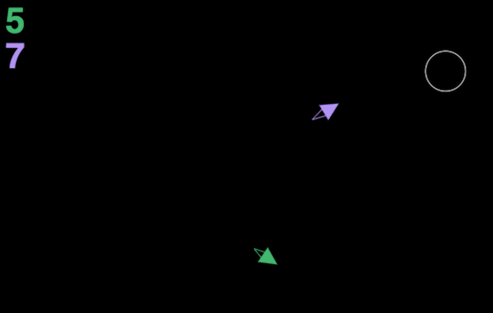

# Rockets!

Rockets is a multiplayer online game, where players control space rockets with their mobile phones. The main objective is to catch as many white circles as possible. During the game circles become smaller and smaller, which makes game more challenging and fun.

Play online: http://rockets.im

## Technical details

Game uses HTML5 Canvas for drawing and socket.io for communication. Game state is stored on viewer side, node.js-based server is just a proxy.

## How to setup and play

The project is not quite in the state when you can start using right away, but I'll get it there eventually. Currently you'll need to clone the repo onto your web-server, install node.js and socket.io package.

## Hack!

Made in one night at Facebook London Hackathon 2013.
